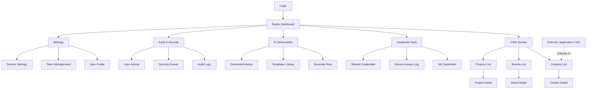
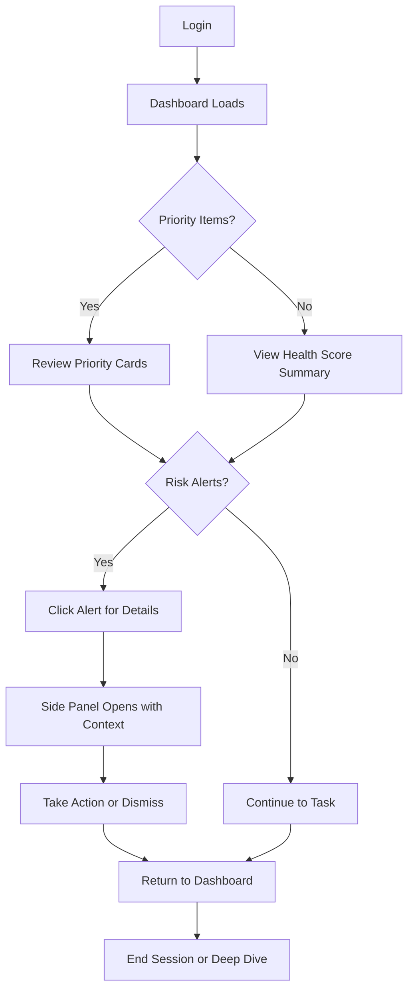
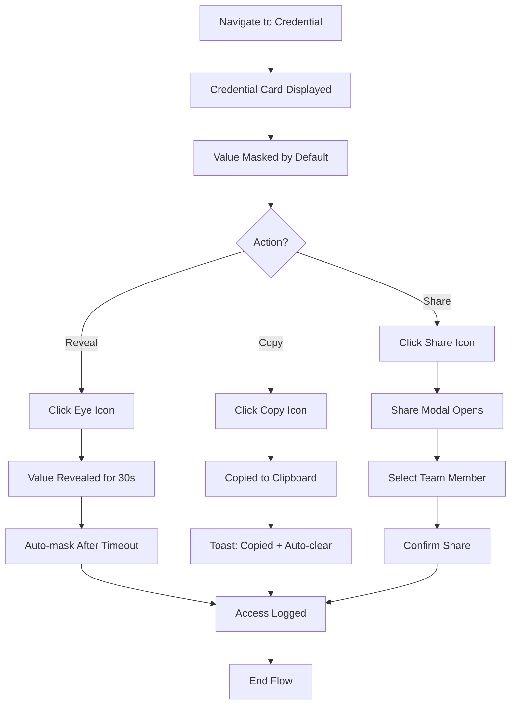
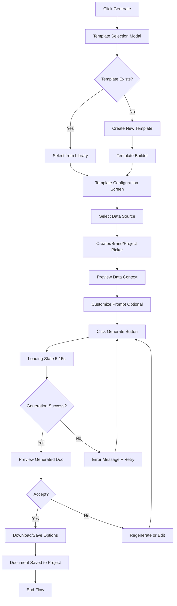
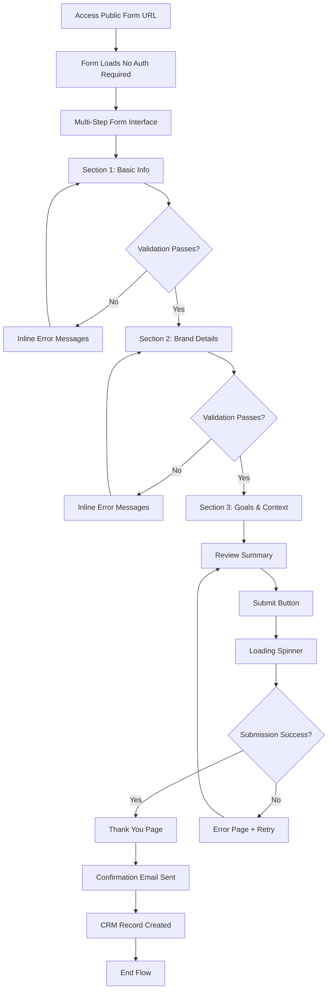
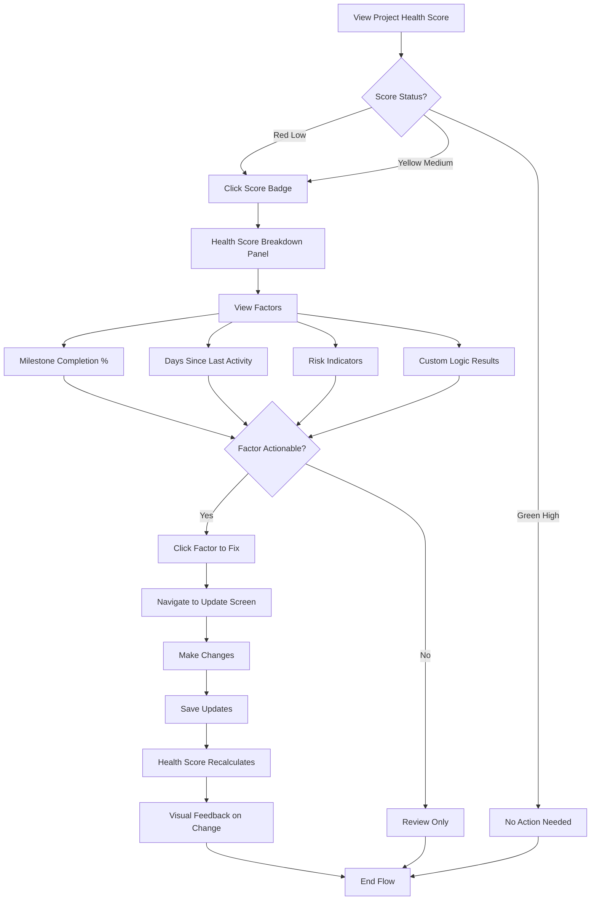

# Studio OS Frontend Specification

**Project Name:** Studio OS  
**Document Type:** UI/UX Specification  
**Version:** 1.0  
**Last Updated:** October 29, 2025  
**Author:** UX Expert (Sally)

---

## Introduction

This document defines the user experience goals, information architecture, user flows, and visual design specifications for Studio OS's user interface. It serves as the foundation for visual design and frontend development, ensuring a cohesive and user-centered experience.

### Overall UX Goals & Principles

#### Target User Personas

**Primary Persona: Studio Founder (Power User)**
- **Profile:** Wavelaunch Studio founders who need rapid access to critical operational data
- **Technical Level:** High - comfortable with complex interfaces and keyboard shortcuts
- **Context:** Time-constrained executives who need to make quick decisions based on current project status
- **Pain Points:** Scattered data across multiple tools, manual credential management, time wasted on administrative tasks
- **Goals:** Quick visibility into project health, secure credential access, rapid status updates, automated report generation

**Secondary Persona: Core Team Member**
- **Profile:** Studio team members who manage day-to-day creator and brand operations
- **Technical Level:** Medium to High - familiar with CRM systems and project management tools
- **Context:** Daily users who perform CRUD operations, track milestones, and generate deliverables
- **Pain Points:** Manual data entry, lack of standardized templates, difficulty finding information
- **Goals:** Efficient data management, quick access to creator/brand information, template-based automation

#### Usability Goals

1. **Speed of Access:** Founders can view priority items and health scores within 2 seconds of login
2. **Credential Security:** Sensitive credentials require explicit reveal action, with all access logged
3. **Efficiency of Data Entry:** Application form captures reduce manual CRM data entry by 80%
4. **Task Automation:** AI deliverable generation reduces document creation time from hours to minutes
5. **Error Prevention:** Inline validation and confirmation dialogs prevent data loss and accidental operations
6. **Discoverability:** Global search finds any creator, brand, or project within 3 keystrokes

#### Design Principles

1. **Operational Efficiency Over Aesthetics** - This is a command center, not a consumer app. Prioritize information density, keyboard shortcuts, and rapid task completion over visual flourishes.

2. **Trust Through Transparency** - Security and audit capabilities should be visible throughout the interface. Users need to feel confident that credentials are protected and all actions are tracked.

3. **Progressive Disclosure with Context Preservation** - Use side panels and modal overlays to show details without losing context. Users should rarely need to "go back" or lose their place.

4. **Status-Driven Interface** - Visual indicators (health scores, risk badges, priority flags) should be omnipresent, allowing users to assess situation at a glance.

5. **Action-Oriented Design** - Every screen should surface relevant quick actions. Users shouldn't hunt for common operations.

### Change Log

| Date | Version | Description | Author |
|------|---------|-------------|--------|
| October 29, 2025 | 1.0 | Initial frontend specification | UX Expert (Sally) |

---

## Information Architecture (IA)

### Site Map / Screen Inventory

### Navigation Structure

**Primary Navigation:** 
Fixed left sidebar (collapsible) with icon + label navigation:
- Studio Dashboard (home icon)
- CRM (database icon)
- Credential Vault (lock icon)
- AI Deliverables (sparkles icon)
- Audit & Security (shield icon)
- Settings (gear icon)

Active section highlighted with accent color bar and background tint.

**Secondary Navigation:**
Contextual tab navigation appears in main content area when viewing detail screens:
- Creator Detail: Overview | Projects | History | Activity
- Brand Detail: Overview | Creators | Projects | Credentials | History
- Project Detail: Overview | Milestones | Deliverables | Team | History

**Breadcrumb Strategy:**
Breadcrumbs appear at top of main content area for deep navigation:
- Format: Section > Subsection > Current Item
- Example: CRM > Brands > "Creator Brand Name" > Project Details
- Each segment is clickable to navigate up hierarchy

**Global Elements:**
- **Header Bar:** Logo, Global Search, Quick Actions, User Menu, Notifications
- **Command Palette:** Accessible via Cmd/Ctrl+K for keyboard-first navigation

---

## User Flows

### Flow 1: Daily Founder Check-In

**User Goal:** Review priority items and project health within first 60 seconds of day

**Entry Points:** Direct login to dashboard

**Success Criteria:** Founder can identify top 3 priority items and any risk alerts without clicking into details

**Edge Cases & Error Handling:**
- No projects exist: Show onboarding prompt to create first creator/brand
- All projects healthy: Display congratulatory message with total project count
- Network timeout: Show cached dashboard data with "Last Updated" timestamp
- Multiple critical alerts: Prioritize by severity and recency

**Notes:** Dashboard is the default landing page post-login. Must load critical data (priority items, health scores) within 2 seconds per NFR4.

### Flow 2: Secure Credential Access

**User Goal:** Safely retrieve a stored credential (password, API key) while maintaining audit trail

**Entry Points:** 
- Dashboard quick action
- Brand detail page "Credentials" tab
- Creator detail page linked credentials
- Direct navigation to Vault

**Success Criteria:** User retrieves credential with one click to copy, with access logged automatically

**Edge Cases & Error Handling:**
- Credential decryption fails: Show error with "Contact Admin" option
- User lacks permission: Display "Request Access" button with notification to admin
- Copy fails (clipboard API unavailable): Show manual copy field with select-all
- Share recipient already has access: Indicate existing access in modal
- Multiple simultaneous reveals: Track each reveal separately in audit log

**Notes:** All credential actions must be logged per FR10. Use animation to draw attention to auto-masking countdown.

### Flow 3: AI Deliverable Generation

**User Goal:** Generate a customized document (proposal, report, brief) using application form data and CRM context

**Entry Points:**
- Dashboard "Generate Deliverable" quick action
- Project detail page "Deliverables" tab
- AI Deliverables section main page

**Success Criteria:** User generates on-brand deliverable document in under 60 seconds with one-click download

**Edge Cases & Error Handling:**
- AI API timeout: Show progress indicator, allow background generation with notification
- Insufficient data context: Highlight missing fields, offer to complete in CRM first
- Template variables missing: Show warning, allow generation with placeholders
- Generation limit reached: Display quota message with upgrade/reset information
- Malformed output: Automatic retry with adjusted prompt, escalate to error if fails twice

**Notes:** Leverage application form data as primary context source. Support markdown and PDF output formats.

### Flow 4: Application Form Submission (External User)

**User Goal:** Submit creator/brand application through public form, with data automatically captured in CRM

**Entry Points:** Public URL shared via email, social media, or website

**Success Criteria:** Applicant completes 24+ question form with inline validation, receives confirmation, and data appears in CRM instantly

**Edge Cases & Error Handling:**
- Form abandonment: Auto-save progress to browser localStorage, resume on return
- Duplicate submission: Detect by email/brand name, show "Already submitted" message with contact option
- Database unavailable: Queue submission in temporary storage, process when available
- Invalid file uploads: Show file type/size requirements, reject with clear error
- Network interruption: Cache submission, allow offline completion with sync on reconnect

**Notes:** Form must be mobile-responsive as many applicants will submit via phone. Progress indicator essential for long form.

### Flow 5: Project Health Score Review

**User Goal:** Understand why a project has a specific health score and take corrective action

**Entry Points:**
- Dashboard health score widget
- Projects list with color-coded scores
- Project detail page

**Success Criteria:** User identifies root cause of poor health score and updates relevant data in under 2 minutes

**Edge Cases & Error Handling:**
- Score calculation logic undefined: Show "Configuration Needed" with admin link
- Conflicting factors: Show weighted breakdown with explanation
- Score frozen: Indicate "Archived Project" status, prevent edits
- Manual override: Allow admin to set score with required justification note
- Historical comparison: Show trend graph if requested

**Notes:** Health score algorithm should be configurable in Settings. Use color + icons for accessibility.

---

## Wireframes & Mockups

**Primary Design Files:** To be created in Figma after specification approval

### Key Screen Layouts

#### Screen: Studio Dashboard

**Purpose:** Central command center providing at-a-glance visibility into all priority items, health scores, and recent activity

**Key Elements:**
- **Header Bar:** Global search (prominent), quick action buttons (+ New Creator/Brand/Project, Generate Deliverable), notifications bell, user avatar menu
- **Priority Projects Widget (Top Left, 40% width):** 
  - Card-based layout showing 5-8 priority projects
  - Each card: Brand name, health score badge, last updated, primary action button
  - Sort/filter controls: Priority, Health, Last Updated
- **Health Score Summary (Top Right, 30% width):**
  - Donut chart showing distribution (Healthy/At Risk/Critical)
  - Total project count
  - Trend indicator (↑↓ vs last week)
- **Risk Alerts (Middle, Full Width):**
  - Horizontal timeline of critical items requiring attention
  - Color-coded by severity (red > yellow > blue)
  - Click to expand inline
- **Recent Activity Feed (Bottom Left, 40% width):**
  - Live activity widget (last 10 actions)
  - User avatar, action description, timestamp
  - Real-time updates with subtle animation
- **Quick Actions (Bottom Right, 30% width):**
  - Large button tiles for common operations
  - "Add Creator", "Access Vault", "Generate Report", "View All Projects"

**Interaction Notes:**
- Dashboard widgets are drag-and-drop repositionable (saved per user)
- All widgets support expand/collapse state
- Keyboard shortcut hints on hover
- Clicking health score badge opens project detail side panel without navigation

**Design File Reference:** [To be created: Dashboard Overview frame]

#### Screen: Creator Detail

**Purpose:** Comprehensive view of a single creator with all associated brands, projects, and activity history

**Key Elements:**
- **Hero Section:**
  - Creator avatar (uploaded or generated initials)
  - Name (editable inline)
  - Application submission date
  - Status badge (Active, Inactive, Pending)
  - Quick actions: Edit, Archive, Export, Generate Brief
- **Tab Navigation:**
  - Overview | Projects | Linked Brands | Activity History
- **Overview Tab:**
  - Creator Bio (from application form)
  - Contact Information (email, phone, social handles)
  - Key Stats: Total brands, active projects, generated deliverables
  - Application Form Responses (expandable sections)
  - Custom Fields (user-defined key-value pairs)
- **Projects Tab:**
  - Table view: Project Name, Brand, Status, Health, Last Updated
  - Click row to open project detail side panel
- **Linked Brands Tab:**
  - Card grid of associated brands
  - Show relationship type and date established
- **Activity History Tab:**
  - Timeline view of all actions related to this creator
  - Filterable by action type and date range

**Interaction Notes:**
- Breadcrumbs: CRM > Creators > [Creator Name]
- Side panel opens on right for related entities (no full-page navigation)
- All editable fields save on blur with visual confirmation
- Export button generates PDF creator summary

**Design File Reference:** [To be created: Creator Detail frames]

#### Screen: Credential Vault

**Purpose:** Secure storage and access interface for sensitive credentials with comprehensive audit logging

**Key Elements:**
- **Header Section:**
  - Search bar (filter by name, type, associated entity)
  - Filter pills: Type (Password, API Key, Token), Associated With (Creator, Brand, Project)
  - Add Credential button (primary CTA)
- **Credential Grid (Default View):**
  - Card-based layout (3 columns on desktop)
  - Each card: 
    - Credential name (bold)
    - Type icon (lock, key, token)
    - Associated entity (clickable link)
    - Masked value (••••••••)
    - Action buttons: Reveal (eye icon), Copy (clipboard icon), Share (person icon)
    - Last accessed timestamp
- **Credential Detail Modal (On Click):**
  - Full credential information
  - Created date, creator user
  - Access history (last 10 accesses)
  - Share status (who has access)
  - Edit/Delete options
- **Add/Edit Credential Modal:**
  - Form: Name, Type, Value, Associated Entity, Access Level
  - Encryption indicator (always encrypted at rest)
  - Share with team members (multi-select)

**Interaction Notes:**
- Clicking "Reveal" shows value for 30 seconds with countdown animation
- "Copy" provides toast feedback and auto-clears clipboard after 60 seconds
- All actions immediately logged to audit trail
- Hover on credential card shows quick preview (no reveal required)
- Keyboard shortcut: Cmd/Ctrl+K to search vault

**Design File Reference:** [To be created: Credential Vault frames]

#### Screen: AI Deliverable Generator

**Purpose:** Template-based interface for generating customized documents using AI with project context

**Key Elements:**
- **Step 1: Template Selection:**
  - Grid of template cards (filterable by category)
  - Each card: Template name, preview thumbnail, description, "Use Template" button
  - "Create New Template" prominent option
- **Step 2: Data Source Selection:**
  - Dropdown/autocomplete: "Select Creator, Brand, or Project"
  - Preview of available data fields from selection
  - Option to manually add context (text area)
- **Step 3: Prompt Customization (Optional):**
  - Base template prompt (read-only, expandable)
  - Additional instructions field (optional user input)
  - Variable tags visible (e.g., {{creator_name}}, {{brand_description}})
- **Step 4: Generation:**
  - Large "Generate Deliverable" button
  - Loading state (progress bar + "Generating..." message)
  - Estimated time (5-15 seconds)
- **Step 5: Review & Download:**
  - Split view: Original prompt (left) | Generated output (right)
  - Markdown preview with formatting
  - Action buttons: Regenerate, Edit, Download (PDF/MD), Save to Project
  - Version history (if regenerated multiple times)

**Interaction Notes:**
- Entire flow in single-page wizard with progress indicator
- Can exit at any step with "Save Draft" option
- Templates organized by category (Proposals, Reports, Briefs, Updates)
- Smart suggestions based on project stage
- Generated documents auto-saved to project deliverables

**Design File Reference:** [To be created: AI Generator flow frames]

#### Screen: Audit Logs

**Purpose:** Comprehensive searchable log of all system activities for security compliance and troubleshooting

**Key Elements:**
- **Filter Bar (Sticky Top):**
  - Date range picker (presets: Today, Last 7 days, Last 30 days, Custom)
  - User dropdown (All Users + individual selection)
  - Action type dropdown (multi-select)
  - Entity type dropdown (Creator, Brand, Project, Credential, etc.)
  - Status chips (Success, Failed, Warning)
  - Search input (free text across all fields)
  - Export button (CSV with current filters applied)
- **Results Table:**
  - Columns: Timestamp, User, Action, Entity Type, Entity Name, Status, Details (expandable)
  - Sort by any column
  - Row expansion shows JSON formatted details
  - Color-coded status: Green (success), Red (failed), Yellow (warning)
  - Pagination: 100 logs per page
- **Security Events Tab:**
  - Special filtered view of security-relevant events
  - Severity indicators (Critical, High, Medium, Low)
  - Highlighted rows for critical events
  - Quick filter for common patterns (failed logins, unusual access times)
- **Analytics Widget (Top Right):**
  - Most active users (bar chart)
  - Action distribution (pie chart)
  - Activity heatmap (day/hour grid)

**Interaction Notes:**
- Filters persist across sessions (saved in localStorage)
- "Saved Searches" feature for frequently used filter combinations
- Click any entity name to jump to that entity's detail view
- Real-time updates (new logs appear with brief highlight animation)
- Keyboard navigation: Arrow keys to move between rows, Enter to expand

**Design File Reference:** [To be created: Audit Logs frames]

---

## Component Library / Design System

**Design System Approach:** 
Build custom design system using shadcn/ui as foundation, extended with Studio OS-specific components. Prioritize consistency, reusability, and accessibility (WCAG 2.1 AA minimum).

### Core Components

#### Component: Health Score Badge

**Purpose:** Visual indicator of project health displayed throughout application

**Variants:**
- Size: Small (16px), Medium (24px), Large (32px)
- Status: Healthy (green), At Risk (yellow), Critical (red), Unknown (gray)
- Style: Filled circle, Outlined circle, Filled pill, Outlined pill

**States:**
- Default: Static display
- Hover: Shows tooltip with breakdown (e.g., "72% - Good milestone completion")
- Active/Clicked: Expands to show detailed health factors
- Loading: Animated pulse while calculating

**Usage Guidelines:**
- Always include numeric score (0-100) alongside color
- Pair with text label for accessibility
- Use pill variant when space allows for context (e.g., "Health: 72% Good")
- Never use color alone to convey status

#### Component: Credential Card

**Purpose:** Secure display container for sensitive credentials with reveal/copy/share actions

**Variants:**
- Compact: Icon, name, masked value, copy button only
- Standard: + Type badge, associated entity link, last accessed
- Expanded: + Access history, share status, edit/delete actions

**States:**
- Masked (default): Value shown as •••••••• or *******
- Revealed: Actual value visible with 30s countdown timer
- Copied: Brief visual feedback (green checkmark, toast notification)
- Shared: Indicator showing "Shared with 3 team members"
- Disabled: Grayed out if user lacks access permission

**Usage Guidelines:**
- Default to masked state always
- Reveal requires explicit user action (click eye icon)
- Auto-mask after timeout with prominent countdown
- Log every reveal/copy action
- Never allow credentials in clipboard longer than 60 seconds

#### Component: Priority Flag

**Purpose:** Visual indicator to mark high-priority items across projects, tasks, and entities

**Variants:**
- P0 (Critical): Red flag, "Urgent" label
- P1 (High): Orange flag, "High Priority"
- P2 (Medium): Yellow flag, "Medium Priority"  
- P3 (Low): Blue flag, "Low Priority"
- None: No flag

**States:**
- Static display
- Editable: Dropdown to change priority level
- Hover: Shows tooltip with priority details and last updated

**Usage Guidelines:**
- Limit P0 usage to truly urgent items only
- Always show in consistent location (top-right of cards/rows)
- Allow quick priority changes via dropdown
- Log priority changes in audit trail

#### Component: Action Button Group

**Purpose:** Consistent button grouping for primary/secondary actions in panels and modals

**Variants:**
- Two-button: Primary (filled) + Secondary (outlined)
- Three-button: Primary + Secondary + Destructive (red outlined)
- Split: Primary with dropdown for additional actions

**States:**
- Default
- Hover (elevation increase)
- Active (pressed state)
- Loading (spinner replaces text)
- Disabled (grayed out, not clickable)

**Usage Guidelines:**
- Primary action always on right (Western reading pattern)
- Destructive actions require confirmation modal
- Loading state maintains button width (no layout shift)
- Keyboard: Tab navigation, Enter/Space to activate

#### Component: Side Panel

**Purpose:** Context-preserving detail view that slides in from right side of screen

**Variants:**
- Narrow (400px): Quick views, simple forms
- Medium (600px): Standard detail views
- Wide (800px): Complex forms, multi-column content

**States:**
- Hidden (off-screen right)
- Sliding In (animated entrance)
- Open (fully visible with backdrop)
- Sliding Out (animated exit)

**Usage Guidelines:**
- Use for detail views to avoid full-page navigation
- Include close button (X) in top-right
- Click backdrop to close (with confirmation if unsaved changes)
- Keyboard: Escape to close, Tab trap within panel
- Stack multiple panels if needed (breadcrumb trail at top)

#### Component: Status Badge

**Purpose:** Indicate current status of projects, creators, brands, and workflows

**Variants:**
- Draft (gray): Initial state, incomplete
- Active (green): Currently operational
- Pending (yellow): Awaiting action/approval
- Paused (blue): Temporarily inactive
- Completed (green checkmark): Finished successfully
- Archived (gray strikethrough): Historical record

**States:**
- Static display
- Editable (dropdown to change status)
- Transitioning (brief animation on status change)

**Usage Guidelines:**
- Always use consistent color mapping
- Include icon alongside text for quick scanning
- Allow status changes with workflow validation
- Log all status changes with timestamp and user

#### Component: Search Palette (Command Palette)

**Purpose:** Keyboard-first global search and navigation interface

**Variants:**
- Full (all entity types searchable)
- Scoped (limited to current section)

**States:**
- Hidden (activated by Cmd/Ctrl+K)
- Open (modal overlay with search input focused)
- Searching (loading spinner during query)
- Results Displayed (grouped by entity type)
- Empty State ("No results found")

**Usage Guidelines:**
- Always accessible via keyboard shortcut
- Search across all entity types (Creators, Brands, Projects, Credentials)
- Show recent searches and frequent items
- Support fuzzy matching
- Navigate results with arrow keys, Enter to select
- Escape to close

---

## Branding & Style Guide

### Visual Identity

**Brand Guidelines:** 
Studio OS uses a professional, modern aesthetic that communicates trust, security, and operational excellence. The visual language should feel like enterprise software—polished and purposeful, not playful.

### Color Palette

| Color Type | Hex Code | Usage |
|------------|----------|-------|
| Primary | #2563EB | Primary actions, links, active states, brand accent |
| Secondary | #64748B | Secondary buttons, muted text, borders |
| Accent | #8B5CF6 | Highlights, AI-powered features, special badges |
| Success | #10B981 | Healthy status, confirmations, positive actions |
| Warning | #F59E0B | At-risk status, cautions, important notices |
| Error | #EF4444 | Critical status, errors, destructive actions |
| Neutral | #F8FAFC (bg), #1E293B (text), #E2E8F0 (border) | Backgrounds, text hierarchy, UI chrome |

**Additional Semantic Colors:**
- Priority Red: #DC2626 (P0 Critical)
- Priority Orange: #F97316 (P1 High)
- Priority Yellow: #EAB308 (P2 Medium)
- Priority Blue: #3B82F6 (P3 Low)

### Typography

**Font Families:**
- **Primary:** Inter (400, 500, 600, 700) - UI text, body copy
- **Secondary:** Inter (same weights) - No secondary font needed
- **Monospace:** JetBrains Mono (400, 500) - Credentials, technical data, code

**Type Scale:**

| Element | Size | Weight | Line Height | Usage |
|---------|------|--------|-------------|-------|
| H1 | 30px | 700 | 1.2 | Page titles, major sections |
| H2 | 24px | 600 | 1.3 | Section headings, modal titles |
| H3 | 20px | 600 | 1.4 | Subsection headings, card titles |
| Body | 16px | 400 | 1.5 | Primary body text, descriptions |
| Small | 14px | 400 | 1.5 | Secondary text, metadata, timestamps |
| Tiny | 12px | 500 | 1.4 | Labels, badges, auxiliary info |

### Iconography

**Icon Library:** Lucide Icons (https://lucide.dev)

**Usage Guidelines:**
- Default size: 20px (scale to 16px for small, 24px for large contexts)
- Stroke width: 2px (consistent with icon set)
- Color: Inherit from text color or use semantic colors
- Always pair icons with text labels for primary actions
- Icon-only buttons must have aria-label for accessibility

**Common Icon Mappings:**
- Database: Creators, Brands, Projects
- Lock: Credential Vault, Security features
- Sparkles: AI features, deliverable generation
- Shield: Audit, security events
- Activity: Recent activity, logs
- Search: Global search, filters
- Plus: Create new actions
- Eye/EyeOff: Reveal/hide credentials
- Copy: Copy to clipboard
- Share: Share credentials/resources

### Spacing & Layout

**Grid System:** 
12-column grid with flexible gutters:
- Desktop (≥1280px): 24px gutters
- Tablet (768-1279px): 16px gutters
- Mobile (<768px): 12px gutters

**Spacing Scale:** 
8px base unit system (4px, 8px, 12px, 16px, 24px, 32px, 48px, 64px)
- Use 4px for tight spacing (badges, inline elements)
- Use 8px for standard component spacing
- Use 16px for section spacing within cards
- Use 24px for spacing between cards/sections
- Use 32px+ for major layout spacing

**Content Max-Width:** 1440px (centered on larger screens)

---

## Accessibility Requirements

### Compliance Target

**Standard:** WCAG 2.1 Level AA

Studio OS is an internal tool, but accessibility remains a priority for team members with diverse abilities and future external use cases.

### Key Requirements

**Visual:**
- Color contrast ratios: 
  - Text: Minimum 4.5:1 (normal text), 3:1 (large text 18px+)
  - UI Components: Minimum 3:1 for interactive elements
  - Status indicators: Never rely on color alone (pair with icons/text)
- Focus indicators: 
  - Visible focus ring (2px solid, primary color) on all interactive elements
  - Never remove focus styling without replacement
  - Focus order follows logical reading order
- Text sizing: 
  - Minimum 16px for body text
  - Support browser zoom up to 200% without breaking layout
  - All text must be resizable

**Interaction:**
- Keyboard navigation: 
  - All functionality accessible via keyboard
  - Tab/Shift+Tab to navigate
  - Enter/Space to activate
  - Escape to close modals/panels
  - Arrow keys for dropdowns/lists
  - Command palette (Cmd/Ctrl+K) for power users
- Screen reader support: 
  - Semantic HTML (headings, lists, landmarks)
  - ARIA labels on icon-only buttons
  - ARIA live regions for dynamic updates (toasts, live activity feed)
  - Form labels properly associated
  - Error messages announced
- Touch targets: 
  - Minimum 44x44px for all interactive elements (mobile)
  - Adequate spacing between adjacent targets (8px minimum)

**Content:**
- Alternative text: 
  - All images have descriptive alt text
  - Decorative images use empty alt=""
  - Icons paired with text or have aria-label
- Heading structure: 
  - Proper hierarchy (H1 > H2 > H3, no skipping levels)
  - Only one H1 per page
  - Headings describe content structure
- Form labels: 
  - Every input has visible label
  - Required fields marked (asterisk + aria-required)
  - Error messages associated with fields
  - Inline validation with clear messaging

### Testing Strategy

**Automated Testing:**
- Integrate axe-core for accessibility checks in CI/CD
- Run Lighthouse accessibility audits on key pages
- ESLint plugin for JSX accessibility rules

**Manual Testing:**
- Keyboard-only navigation testing on each major flow
- Screen reader testing (NVDA/JAWS on Windows, VoiceOver on Mac)
- Color blindness simulation (verify status indicators work)
- Zoom testing at 200% (ensure no content overlap)

**Continuous Improvement:**
- Quarterly accessibility reviews
- User feedback channel for accessibility issues
- Document known issues and remediation plans

---

## Responsiveness Strategy

### Breakpoints

| Breakpoint | Min Width | Max Width | Target Devices | Priority |
|------------|-----------|-----------|----------------|----------|
| Mobile | 320px | 767px | Phones, small tablets | Medium |
| Tablet | 768px | 1279px | Tablets, small laptops | Low |
| Desktop | 1280px | 1919px | Standard desktops, laptops | **High** |
| Wide | 1920px | - | Large monitors, ultrawide displays | Medium |

**Note:** Studio OS is primarily a desktop application for founders/team members. Mobile support is **secondary** but required for on-the-go credential access and status checks.

### Adaptation Patterns

**Layout Changes:**

**Desktop (Primary):**
- Fixed left sidebar (240px width, collapsible to 64px icon-only)
- Main content area uses full remaining width
- Two-column layouts for dashboard widgets (60/40 split)
- Side panels slide in from right (400-800px width)
- Modals centered with max-width 600px

**Tablet:**
- Sidebar auto-collapses to icon-only (64px)
- Single-column dashboard widgets (stacked vertically)
- Side panels expand to 90% screen width
- Tables adapt to card view for better mobile scanning

**Mobile:**
- Bottom tab bar navigation (replaces left sidebar)
- Full-width single-column layout throughout
- Side panels become full-screen modals
- Tables convert to stacked cards with swipeable rows
- Global search becomes dedicated search page

**Navigation Changes:**

**Desktop:** Fixed left sidebar with expanded labels  
**Tablet:** Collapsible sidebar, hamburger menu  
**Mobile:** Bottom tab bar (5 primary sections), hamburger for secondary nav

**Content Priority:**

**Desktop:** Show all data, utilize screen real estate fully  
**Tablet:** Hide secondary metadata, focus on primary info  
**Mobile:** Progressive disclosure - show essentials, tap to expand details

**Key Content Priorities (Mobile):**
1. Health scores and status indicators (always visible)
2. Primary actions (prominent buttons)
3. Search and navigation
4. Secondary metadata (expandable sections)
5. Audit logs and detailed history (linked to dedicated pages)

**Interaction Changes:**

**Desktop:**
- Hover states on interactive elements
- Right-click context menus (optional)
- Keyboard shortcuts (extensive support)
- Double-click to edit inline

**Tablet:**
- Touch-optimized (larger targets)
- Long-press for context menus
- Reduced keyboard shortcut reliance
- Single-tap to edit

**Mobile:**
- Touch-exclusive (44px minimum targets)
- Swipe gestures (swipe row to reveal actions)
- Bottom sheet modals (easier thumb reach)
- Pull-to-refresh on lists

---

## Animation & Micro-interactions

### Motion Principles

Studio OS uses motion purposefully to:
1. **Provide Feedback:** Confirm user actions (button clicks, saves, copies)
2. **Guide Attention:** Draw focus to important changes (new alerts, score updates)
3. **Show Relationships:** Connect related elements (parent-child, cause-effect)
4. **Reduce Cognitive Load:** Smooth transitions maintain context and orientation

**Constraints:**
- Respect `prefers-reduced-motion` media query (disable decorative animations)
- Keep animations fast (150-300ms for most transitions)
- Never block user actions with animations
- Use easing curves that feel natural (ease-in-out for most, ease-out for entrances)

### Key Animations

- **Button Click:** Scale down to 0.95, duration 100ms, ease-in-out - Tactile feedback for all button interactions
  
- **Card Hover:** Elevation increase (shadow depth), subtle lift (2px translateY), duration 200ms, ease-out - Makes cards feel interactive and inviting

- **Side Panel Entrance:** Slide from right with backdrop fade-in, duration 300ms, ease-out - Smooth context preservation when opening details

- **Toast Notification:** Slide up from bottom-right, auto-dismiss after 4s with fade-out, duration 250ms, ease-out - Non-intrusive success/error feedback

- **Health Score Update:** Pulse effect (scale 1 → 1.1 → 1), color transition to new status, duration 400ms, ease-in-out - Draws attention to important metric changes

- **Credential Reveal:** Fade-in of actual value with shimmer effect, countdown timer animates, duration 300ms, ease-in - Makes security interaction feel intentional

- **Loading States:** Skeleton screens with shimmer wave (2s loop), progress bars with indeterminate animation - Reduces perceived wait time

- **Priority Flag Change:** Bounce effect when priority increases, subtle shake when decreases, duration 300ms, ease-out - Reinforces importance of priority changes

- **Search Results Appear:** Staggered fade-in from top (50ms delay between items), duration 200ms each, ease-out - Makes result appearance feel snappy

- **Audit Log Live Update:** Brief highlight flash (yellow background fade-in/out), duration 800ms, ease-in-out - Draws attention to new entries in real-time feed

---

## Performance Considerations

### Performance Goals

- **Page Load:** Initial dashboard render < 2 seconds (per NFR4)
- **Interaction Response:** Button clicks, form submissions < 200ms feedback
- **Animation FPS:** Maintain 60 FPS for all animations and transitions
- **Time to Interactive (TTI):** < 3 seconds on desktop, < 5 seconds on mobile

### Design Strategies

**Optimize Asset Loading:**
- Use WebP format for images (fallback to PNG)
- Implement lazy loading for below-fold content
- SVG icons (Lucide) loaded as sprite sheet
- Font subsetting (only load used glyphs from Inter)

**Reduce Re-renders:**
- Use React.memo for expensive components (tables, large lists)
- Virtualize long lists (projects, audit logs) - render only visible rows
- Debounce search inputs (300ms delay)
- Throttle scroll event handlers

**Progressive Enhancement:**
- Critical CSS inlined in HTML head
- Non-critical CSS loaded asynchronously
- Defer non-essential JavaScript
- Skeleton screens while loading data

**Data Fetching:**
- Implement stale-while-revalidate caching strategy
- Prefetch likely navigation targets on hover
- Batch API requests where possible
- Use GraphQL fragments to fetch only needed fields

**Visual Performance:**
- Use CSS transforms (translate, scale) instead of positioning for animations (GPU acceleration)
- Avoid layout thrashing (batch DOM reads/writes)
- Use `will-change` property sparingly for known animated elements
- Limit box-shadow complexity (use simple shadows)

---

## Next Steps

### Immediate Actions

1. **Review and Approval:** Share this specification with Wavelaunch Studio founders for feedback and approval on UX approach, screen layouts, and component library.

2. **Visual Design Creation:** Create high-fidelity mockups in Figma for the following priority screens:
   - Studio Dashboard (with all widgets)
   - Creator Detail (all tabs)
   - Credential Vault (grid and detail views)
   - AI Deliverable Generator (full flow)
   - External Application Form (mobile-first)

3. **Component Library Setup:** Begin building reusable components in Storybook using shadcn/ui as foundation:
   - Health Score Badge
   - Credential Card
   - Priority Flag
   - Side Panel
   - Action Button Group
   - Status Badge
   - Search Palette

4. **Handoff to Architect:** Once specification is approved, proceed to Frontend Architecture document creation to define:
   - Component architecture and folder structure
   - State management approach (Context API vs Zustand vs Redux)
   - API integration patterns
   - Authentication flow implementation
   - Testing strategy

5. **Accessibility Baseline:** Set up automated accessibility testing tools in development environment:
   - Install axe-core DevTools extension
   - Configure ESLint jsx-a11y plugin
   - Document accessibility testing checklist

### Design Handoff Checklist

- [x] All user flows documented
- [x] Component inventory complete
- [x] Accessibility requirements defined
- [x] Responsive strategy clear
- [x] Brand guidelines incorporated
- [x] Performance goals established
- [ ] High-fidelity mockups created (Figma) - **Next Step**
- [ ] Component library initialized (Storybook) - **Next Step**
- [ ] Interactive prototype for key flows - **Optional**
- [ ] Usability testing plan - **Optional**

---

## Appendix: Design Decisions & Rationale

### Why Dashboard-First Navigation?

**Decision:** Make the dashboard the default landing page and primary navigation hub.

**Rationale:** Founders need immediate visibility into project health and priorities. Starting with a dashboard reduces cognitive load and time-to-insight. Alternative approaches (list-first or search-first) would require additional navigation steps to reach critical information.

### Why Side Panels Over Full-Page Navigation?

**Decision:** Use sliding side panels for detail views instead of full-page transitions.

**Rationale:** Preserves context and reduces cognitive load. Users can view details without losing their place in the list or dashboard. This pattern is common in modern web apps (Linear, Notion) and feels more fluid than traditional multi-page navigation.

### Why Explicit Credential Reveal Over Auto-Reveal?

**Decision:** Require explicit user action (click eye icon) to reveal credentials, with auto-masking after 30 seconds.

**Rationale:** Security-first design. Accidental credential exposure is a major risk. Explicit reveal creates intentional action and supports comprehensive audit logging. Auto-masking prevents credentials from remaining visible when user walks away from screen.

### Why Command Palette (Cmd+K)?

**Decision:** Implement global command palette accessible via keyboard shortcut.

**Rationale:** Power users (founders and team members) benefit from keyboard-first workflows. Command palette enables rapid navigation without mouse, reducing time to complete common tasks. This pattern has proven successful in developer tools (VS Code, GitHub) and productivity apps (Slack, Notion).

### Why Light Mode Only (Initially)?

**Decision:** Launch with light mode UI only, no dark mode in MVP.

**Rationale:** Reduces design and development complexity for MVP. Internal tool used during business hours in office settings where light mode is standard. Dark mode can be added post-MVP based on user feedback and usage patterns.

### Why 8px Spacing System?

**Decision:** Use 8px base unit for spacing scale.

**Rationale:** Creates visual rhythm and consistency. 8px is divisible by 4 and 2, allowing for flexible intermediate values (4px for tight spacing). Aligns with common design systems (Material, Tailwind) and makes developer handoff easier with clear spacing guidelines.

---

**End of Frontend Specification**

**Document Status:** ✅ Complete - Ready for Review  
**Next Agent:** Architect (Winston) - Create Frontend Architecture Document  
**Estimated Review Time:** 30-45 minutes  
**Key Stakeholders:** Wavelaunch Studio Founders, Core Team
