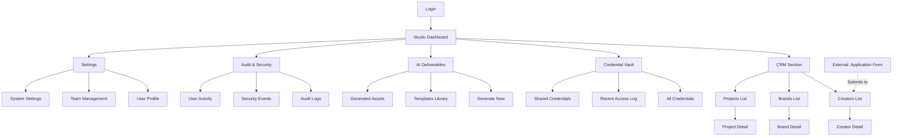

# Information Architecture (IA)

## Site Map / Screen Inventory

## Navigation Structure

**Primary Navigation:** 
Fixed left sidebar (collapsible) with icon + label navigation:
- Studio Dashboard (home icon)
- CRM (database icon)
- Credential Vault (lock icon)
- AI Deliverables (sparkles icon)
- Audit & Security (shield icon)
- Settings (gear icon)

Active section highlighted with accent color bar and background tint.

**Secondary Navigation:**
Contextual tab navigation appears in main content area when viewing detail screens:
- Creator Detail: Overview | Projects | History | Activity
- Brand Detail: Overview | Creators | Projects | Credentials | History
- Project Detail: Overview | Milestones | Deliverables | Team | History

**Breadcrumb Strategy:**
Breadcrumbs appear at top of main content area for deep navigation:
- Format: Section > Subsection > Current Item
- Example: CRM > Brands > "Creator Brand Name" > Project Details
- Each segment is clickable to navigate up hierarchy

**Global Elements:**
- **Header Bar:** Logo, Global Search, Quick Actions, User Menu, Notifications
- **Command Palette:** Accessible via Cmd/Ctrl+K for keyboard-first navigation

---
