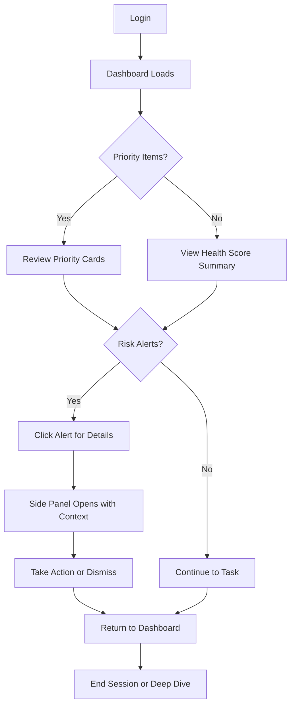
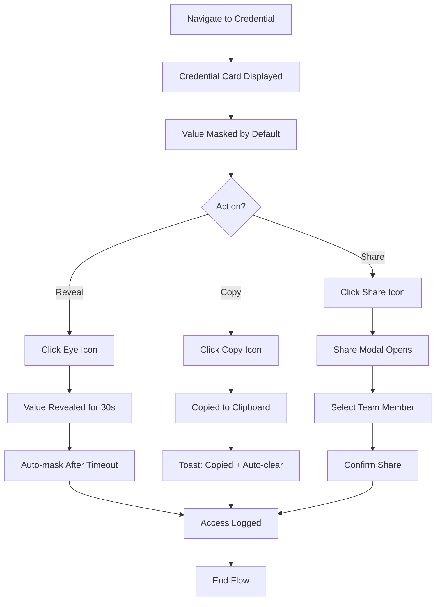
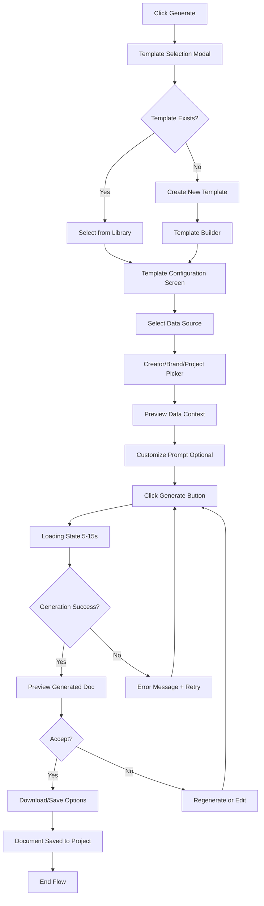
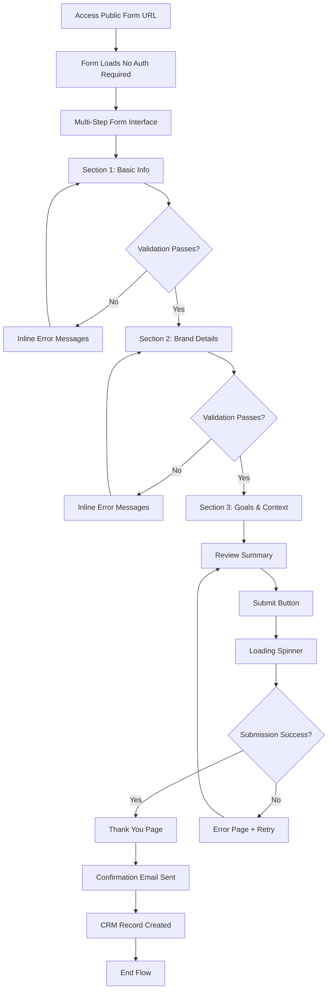
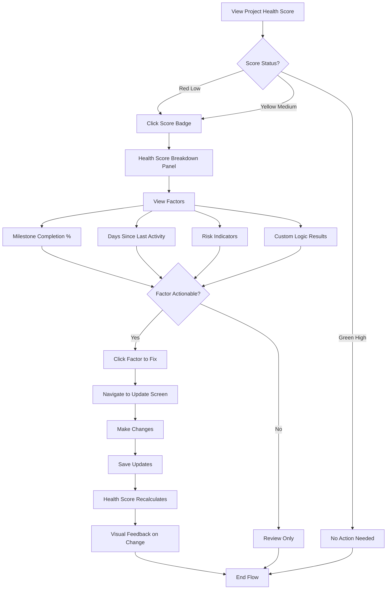

# User Flows

## Flow 1: Daily Founder Check-In

**User Goal:** Review priority items and project health within first 60 seconds of day

**Entry Points:** Direct login to dashboard

**Success Criteria:** Founder can identify top 3 priority items and any risk alerts without clicking into details

**Edge Cases & Error Handling:**
- No projects exist: Show onboarding prompt to create first creator/brand
- All projects healthy: Display congratulatory message with total project count
- Network timeout: Show cached dashboard data with "Last Updated" timestamp
- Multiple critical alerts: Prioritize by severity and recency

**Notes:** Dashboard is the default landing page post-login. Must load critical data (priority items, health scores) within 2 seconds per NFR4.

## Flow 2: Secure Credential Access

**User Goal:** Safely retrieve a stored credential (password, API key) while maintaining audit trail

**Entry Points:** 
- Dashboard quick action
- Brand detail page "Credentials" tab
- Creator detail page linked credentials
- Direct navigation to Vault

**Success Criteria:** User retrieves credential with one click to copy, with access logged automatically

**Edge Cases & Error Handling:**
- Credential decryption fails: Show error with "Contact Admin" option
- User lacks permission: Display "Request Access" button with notification to admin
- Copy fails (clipboard API unavailable): Show manual copy field with select-all
- Share recipient already has access: Indicate existing access in modal
- Multiple simultaneous reveals: Track each reveal separately in audit log

**Notes:** All credential actions must be logged per FR10. Use animation to draw attention to auto-masking countdown.

## Flow 3: AI Deliverable Generation

**User Goal:** Generate a customized document (proposal, report, brief) using application form data and CRM context

**Entry Points:**
- Dashboard "Generate Deliverable" quick action
- Project detail page "Deliverables" tab
- AI Deliverables section main page

**Success Criteria:** User generates on-brand deliverable document in under 60 seconds with one-click download

**Edge Cases & Error Handling:**
- AI API timeout: Show progress indicator, allow background generation with notification
- Insufficient data context: Highlight missing fields, offer to complete in CRM first
- Template variables missing: Show warning, allow generation with placeholders
- Generation limit reached: Display quota message with upgrade/reset information
- Malformed output: Automatic retry with adjusted prompt, escalate to error if fails twice

**Notes:** Leverage application form data as primary context source. Support markdown and PDF output formats.

## Flow 4: Application Form Submission (External User)

**User Goal:** Submit creator/brand application through public form, with data automatically captured in CRM

**Entry Points:** Public URL shared via email, social media, or website

**Success Criteria:** Applicant completes 24+ question form with inline validation, receives confirmation, and data appears in CRM instantly

**Edge Cases & Error Handling:**
- Form abandonment: Auto-save progress to browser localStorage, resume on return
- Duplicate submission: Detect by email/brand name, show "Already submitted" message with contact option
- Database unavailable: Queue submission in temporary storage, process when available
- Invalid file uploads: Show file type/size requirements, reject with clear error
- Network interruption: Cache submission, allow offline completion with sync on reconnect

**Notes:** Form must be mobile-responsive as many applicants will submit via phone. Progress indicator essential for long form.

## Flow 5: Project Health Score Review

**User Goal:** Understand why a project has a specific health score and take corrective action

**Entry Points:**
- Dashboard health score widget
- Projects list with color-coded scores
- Project detail page

**Success Criteria:** User identifies root cause of poor health score and updates relevant data in under 2 minutes

**Edge Cases & Error Handling:**
- Score calculation logic undefined: Show "Configuration Needed" with admin link
- Conflicting factors: Show weighted breakdown with explanation
- Score frozen: Indicate "Archived Project" status, prevent edits
- Manual override: Allow admin to set score with required justification note
- Historical comparison: Show trend graph if requested

**Notes:** Health score algorithm should be configurable in Settings. Use color + icons for accessibility.

---
